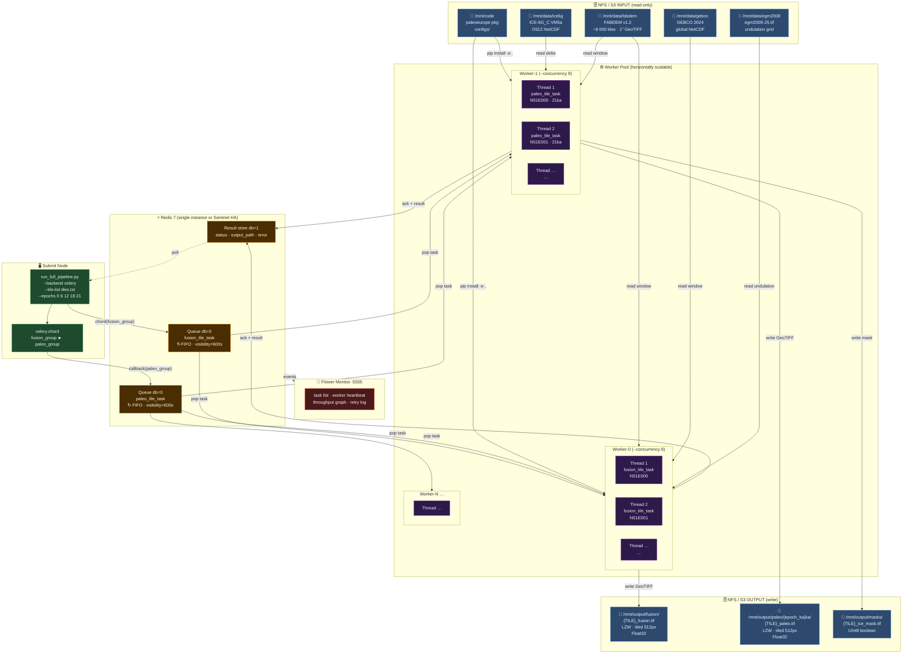
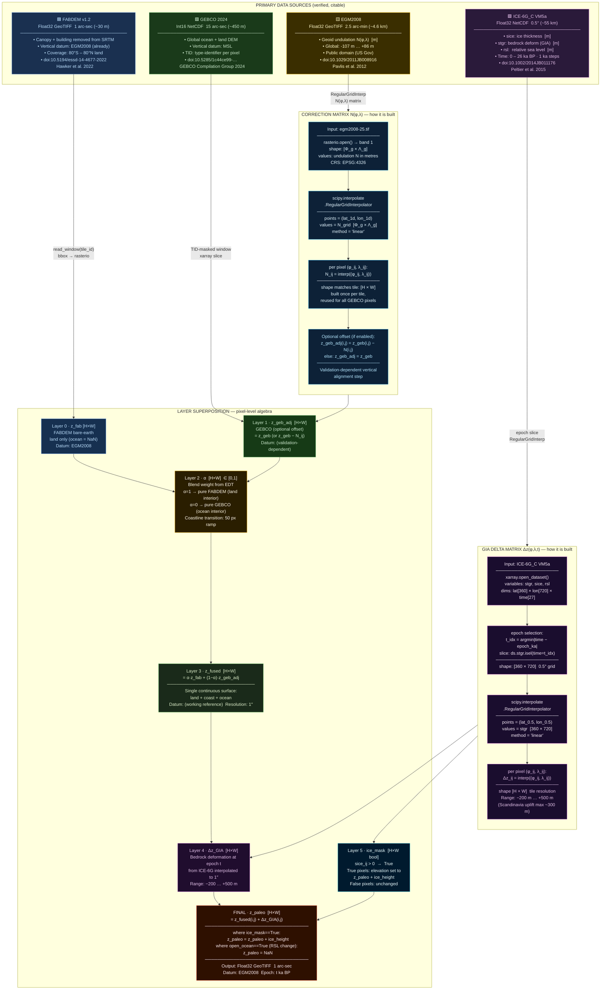

# Architecture Diagrams

Three Mermaid diagrams describing the paleoeurope-dem pipeline architecture.
Render with any Mermaid-compatible viewer (GitHub, VSCode Markdown Preview Enhanced, etc.)

---

## 1. Multi-Node Infrastructure

Queue, task manager, network disks (input/code) and network disks (output).

---

## 2. ETL Pipeline — Atomic Algorithm

Block diagram of the full pipeline at the level of individual function calls and array operations.

```mermaid
flowchart TD
    START([" tile_id  ·  epoch_ka "])

    subgraph STAGE1["STAGE 1 — EXTRACT  (per tile)"]
        S1A["FabdemLoader.read_window(tile_id)\n──────────────────────────────\n① parse SRTM naming → bbox\n② open GeoTIFF with rasterio window\n③ resample to target resolution if needed\n④ mask nodata → np.nan\nout: z_fab  [H×W float32]  EGM2008 ortho height"]:::extract

        S1B["GebcoLoader.read_window(bbox)\n──────────────────────────────\n① open GEBCO NetCDF via xarray\n② slice lat/lon window\n③ TID mask: keep TID∈{0,1,10,11} only\n   (direct soundings + predicted)\n④ reproject WGS84 → tile CRS\nout: z_geb  [H×W float32]  MSL depth/height"]:::extract

        S1C["Optional: DatumCorrector.align(z_geb, bbox)\n──────────────────────────────\n(enabled only when validated)\n① open egm2008-25.tif\n② RegularGridInterpolator(φ,λ) → N(φ,λ)\n③ if enabled:  z_geb_adj = z_geb − N\n   else:       z_geb_adj = z_geb\nout: z_geb_adj  [H×W float32]\n     N_grid      [H×W float32]  undulation"]:::extract
    end

    subgraph STAGE2["STAGE 2 — TRANSFORM A  (fusion)"]
        S2A["Coastline mask\n──────────────────────────────\n① z_fab > 0  →  land_mask  [bool]\n② z_geb_adj ≤ 0  →  ocean_mask  [bool]\n③ conflict pixels → FABDEM wins\nout: land_mask, ocean_mask"]:::transform

        S2B["RasterBlender.compute_alpha(land_mask)\n──────────────────────────────\n① EDT(land_mask) → d_land  [px]\n② EDT(~land_mask) → d_ocean [px]\n③ latitude correction:\n   aspect = (1.0, cos(φ_centre))\n④ signed_dist = d_land − d_ocean  [px]\n⑤ α = clip((signed_dist + D) / (2D), 0, 1)\n   D = blend_distance_px (default 50)\nout: α  [H×W float32]  ∈ [0, 1]"]:::transform

        S2C["RasterBlender.blend(z_fab, z_geb_adj, α)\n──────────────────────────────\n① short-circuit: α≡1 → return z_fab\n② short-circuit: α≡0 → return z_geb_adj\n③ z_fused = α·z_fab + (1−α)·z_geb_adj\nout: z_fused  [H×W float32]"]:::transform
    end

    subgraph STAGE3["STAGE 3 — TRANSFORM B  (GIA)"]
        S3A["Ice6gLoader.get_fields(epoch_ka)\n──────────────────────────────\n① open ICE-6G_C VM5a NetCDF\n② detect dims: lat/lon/time (flexible)\n③ time axis: positive or negative ka\n④ interpolate to nearest epoch\nout: sice  [Φ×Λ float32]  ice thickness [m]\n     dz    [Φ×Λ float32]  bedrock deform [m]\n     rsl   [Φ×Λ float32]  relative sea level [m]"]:::gia

        S3B["apply_gia_delta(z_fused, bbox, epoch_ka)\n──────────────────────────────\n① build RegularGridInterpolator on\n   dz(φ,λ) from ICE-6G grid\n② make pixel coords φ_ij, λ_ij\n③ Δz = interpolator(φ_ij, λ_ij)\n④ z_paleo = z_fused + Δz\nout: z_paleo  [H×W float32]\n     ice_mask [H×W bool]  sice>0 pixels"]:::gia

        S3C["IceEnvelope.surface_elevation(z_paleo, bbox)\n──────────────────────────────\n① where ice_mask==True:\n   z_surface = z_paleo + ice_height\n② bedrock_delta applied under ice\nout: z_full  [H×W float32]\n     (NaN where open ocean, ice→ice surface)"]:::gia
    end

    subgraph STAGE4["STAGE 4 — LOAD  (write outputs)"]
        S4A["write_geotiff(z_fused, path_fusion)\n──────────────────────────────\n driver=GTiff · dtype=float32\n compress=LZW · tiled=YES\n blockxsize=512 · blockysize=512\n EPSG:4326  1″ pixel size"]:::load

        S4B["write_geotiff(z_full, path_paleo)\n+ write_geotiff(ice_mask.uint8, path_mask)\n──────────────────────────────\n subdir: paleo/{epoch_ka}ka/\n ice_mask: UInt8 · 0/1"]:::load
    end

    END(["✓  tile done\nresult → Redis db=1"])

    START --> S1A & S1B
    S1B --> S1C
    S1A --> S2A
    S1C --> S2A
    S2A --> S2B
    S2B --> S2C
    S1A --> S2C
    S1C --> S2C
    S2C --> S4A
    S2C --> S3A
    S3A --> S3B
    S3B --> S3C
    S3C --> S4B
    S4A & S4B --> END

    classDef extract   fill:#1a3a5c,stroke:#5b8dd9,color:#e8f0fe
    classDef transform fill:#1a3a1a,stroke:#4caf50,color:#e8f5e9
    classDef gia       fill:#3a1a3a,stroke:#ce93d8,color:#fce4ec
    classDef load      fill:#3a2a00,stroke:#ffb300,color:#fffde7
```

---

## 3. Data Types, Correction Matrices & Layer Superposition

Verified sources with citations, where each correction matrix is built, and how layers are composited pixel-by-pixel.

